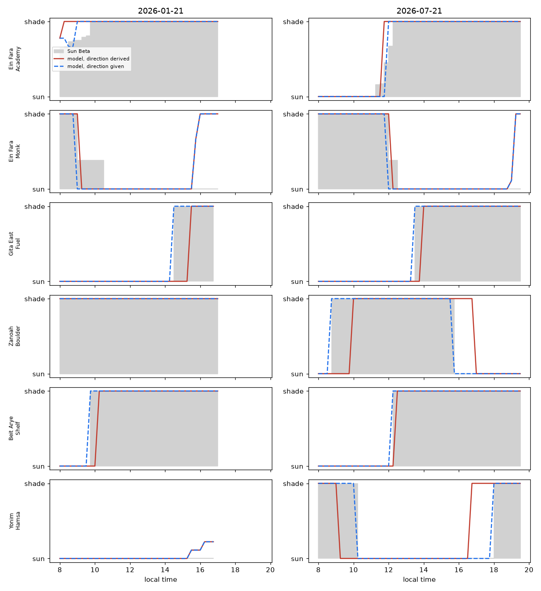

# Shade model

Sun and shade times for climbing sectors, computed from public elevation data.

[Sun Beta](https://sunbeta.app/how-it-works) maps each wall by hand, from a satellite
photo or in the field, then intersects that shape with the sun's position. The hand
mapping is the expensive part. This project asks how much of it a machine can do,
and measures the answer against Sun Beta's own published curves.

Short answer for Israel: everything except one number per sector. Give the model the
compass direction a wall faces and it reproduces Sun Beta to a mean absolute error of
0.09 in shade fraction, with the sun's arrival time exact and its departure time
within 15 minutes. Derive that direction automatically and the error triples, because
no free elevation model of Israel resolves a 30 m cliff.



Grey is Sun Beta. Blue is this model with the wall direction supplied. Red is fully
automatic.

## The model

Three layers. Each is independent and testable.

1. **Sun position.** NREL SPA through `pvlib`, refraction corrected, on a 15 minute
   local-time grid. Accurate to a thousandth of a degree. Not a source of error.
2. **Sky horizon.** Ray march the elevation grid outward from the sector, over 360
   azimuths, on radii that grow geometrically. Keep the steepest line of sight per
   azimuth. Correct for earth curvature and refraction. This is one table per sector
   that every date then reads for free. A near patch at full resolution covers the
   valley; a coarse patch out to 40 km covers the skyline.
3. **Wall geometry.** A point on the wall is sunlit when the sun stands above that
   horizon *and* on the front side of the wall. Sample points up the face, and the
   fraction of them in shade is the sector's shade fraction.

Two ways to get layer 3, depending on the elevation data:

- **Facet model** (`shademodel.model`). Where metre-scale lidar exists, read the wall
  straight off the grid: take every cell steeper than a threshold, within a radius of
  the sector, visible from it. Each cell is an oriented facet weighted by its true
  surface area. Nothing is supplied by hand.
- **Wall model** (`shademodel.wall`). Where only a 30 m grid exists, the cliff is not
  in the data at all, so state it: a vertical face of a given height and compass
  direction, standing at the sector's position. The grid still supplies the horizon.

## Elevation data

| Source | Resolution | Where | Use |
| --- | --- | --- | --- |
| USGS 3DEP | 1 m lidar | USA | Resolves the wall. Facet model works end to end. |
| Copernicus GLO-30 | 30 m | Global, free, no key | Valley shape and skyline. Not the wall. |
| PNOA / swissALTI3D / IGN and other national lidar | 0.5-2 m | Parts of Europe | Same as 3DEP where it exists. |
| Survey of Israel DTM | 1-5 m | Israel | Sold, not open. The upgrade that would close the gap. |
| TanDEM-X 12 m | 12 m | Global | Free for research on application to DLR. Not automatable. |
| OpenStreetMap `natural=cliff` | line geometry | Patchy | Cliff strike, which is the missing wall direction. |

Israel has no open metre-scale elevation model. Copernicus GLO-30 is the ceiling.
At Ein Fara its steepest cell is 42 degrees, in a canyon whose walls are vertical
and 40 m tall. The canyon is in the data; the cliff is not.

## Getting the wall direction

This is the whole remaining problem, and everything below is measured on the same 43
sectors.

### How accurate does it need to be

Perturb the best-fitting direction and score the result. Roughly a minute and a half
of timing error per degree:

| Error in the direction | MAE | Sun arrives | Sun leaves |
| --- | --- | --- | --- |
| 0 deg | 0.092 | 0 min | 15 min |
| 10 deg | 0.126 | 15 min | 30 min |
| 15 deg | 0.146 | 15 min | 30 min |
| 20 deg | 0.167 | 30 min | 45 min |
| 30 deg | 0.212 | 45 min | 45 min |
| 45 deg | 0.279 | 75 min | 75 min |

Half an hour is close enough to plan a day around, so anything inside about 15 degrees
is good enough. That is a low bar. It does not need a survey.

### Four ways to get it

| Method | Error | Effort | Command |
| --- | --- | --- | --- |
| Downhill direction of the landform | about 50 deg | none | `shade aspect --lat --lon` |
| Line traced by the crag's other sectors | 12-20 deg where sectors run along one cliff, useless for scattered boulders | none | automatic inside `crag_aspects` |
| Nearest OpenStreetMap `natural=cliff` way | 14 deg | none where mapped; 2 of 7 crags here | automatic inside `crag_aspects` |
| Two points along the cliff on a satellite image | about 15 deg | 10 seconds per sector | `shade aspect --along lat,lon --along lat,lon` |
| One remembered transition at the crag | see below | one visit, no instrument | `shade aspect --saw DATE:sun@HH:MM` |

The neighbour trick works because sectors are named points along a cliff, so their
local trend is the cliff's strike. It fails where sectors are separate boulders and
towers, which is why Timna and Yonim score worst.

### Asking a climber instead of a compass

Nobody remembers a bearing. People do remember "it came into the sun about quarter
past twelve". Search the directions that reproduce that, and one such memory is worth
most of a surveyed bearing:

| What you have | MAE |
| --- | --- |
| Nothing, direction derived | 0.268 |
| One transition, from one visit | 0.125 |
| Two transitions, opposite seasons | 0.108 |
| The direction itself | 0.092 |

Record which way it went, not only when. A single transition time has two solutions,
one either side of solar noon, and the direction of travel separates them. With that,
Ein Fara's Jeremiah sector fits to 222 degrees from one June observation against 225
from the full-year fit; a second winter observation narrows the band of directions
that fit from 30 degrees to 8.

```sh
shade aspect --lat 31.833828 --lon 35.302755 --tz Asia/Jerusalem \
  --saw 2026-06-21:sun@12:15 --saw 2026-12-21:sun@08:30
```

The reported spread says whether another observation would pay.

## Results

43 sectors across 7 Israeli crags, six dates each, scored against Sun Beta's own
published curves on their 15 minute grid. Shade fraction runs 0 (full sun) to 1
(full shade), so mean absolute error is in the same units.

| Crag | Sectors | MAE, direction derived | MAE, direction supplied |
| --- | --- | --- | --- |
| Shilat | 2 | 0.146 | 0.002 |
| Zanoah | 3 | 0.141 | 0.014 |
| Beit Arye | 4 | 0.187 | 0.020 |
| Yonim | 5 | 0.366 | 0.076 |
| Gita East | 6 | 0.181 | 0.102 |
| Timna | 16 | 0.369 | 0.119 |
| Ein Fara | 7 | 0.179 | 0.136 |
| **All** | **43** | **0.268** | **0.092** |

Median error in the times a climber reads off the chart:

| | Sun arrives | Sun leaves |
| --- | --- | --- |
| Direction derived | 22 min | 60 min |
| Direction supplied | 0 min | 15 min |

### Control: what metre-scale data buys

Red Rocks is the only Sun Beta area with public 1 m lidar. There the facet model runs
end to end with no supplied direction and reaches MAE 0.158 over 5 sectors and 6
dates. Its remaining error is not physics: the sector positions came from Mountain
Project crag centroids that sit 50 m apart, so neighbouring sectors overlap. Sectors
whose position is right score 0.09 to 0.12.

### What the fitting says

Fit the direction and steepness per sector, and the rest of the model reproduces Sun
Beta at MAE 0.09, with many sectors at 0.00 to 0.03. Two facts fall out:

- The best steepness is 90 degrees for 40 of 43 sectors. A sport wall is vertical.
  Assume it.
- Wall height barely matters. Changing it from 15 m to 60 m moves the error by 0.007.
  At 30 m resolution the horizon hardly changes over the height of a crag, so the
  model returns a switch time, not a graded partial-shade curve. Sun Beta's hand
  mapping is what buys the gradation.

## Run it

```sh
uv sync
uv run shade times --lat 31.833828 --lon 35.302755 --tz Asia/Jerusalem --date 2026-06-21 --aspect 225
uv run shade times --lat 36.1555975 --lon -115.4361525 --tz America/Los_Angeles --date 2026-06-21 --lidar
uv run shade aspect --lat 31.833828 --lon 35.302755 --tz Asia/Jerusalem --saw 2026-06-21:sun@12:15
uv run pytest
```

Omit `--aspect` to derive the direction from the terrain, which is the weakest source.

Reproduce the measurements, in this order:

```sh
uv run python scripts/scrape_sunbeta.py israel data/sunbeta_truth.json
uv run python scripts/scrape_27crags.py data/il_coords.json
uv run python scripts/validate_israel.py terrain strike osm combined
uv run python scripts/fit_aspect.py            # what direction would fit, per sector
uv run python scripts/report.py                # the two result tables
uv run python scripts/aspect_sensitivity.py    # the error budget
uv run python scripts/fit_from_observation.py  # what one field observation is worth
uv run python scripts/validate_redrocks.py resolution
```

`fit_aspect.py` writes `out/israel_fit.json`, which the two scripts after it read.

The reference curves belong to Sun Beta. The scrapers stay in the repository; their
output does not.

Elevation tiles, horizon tables and OSM extracts cache under `cache/`. Set
`SHADE_CACHE` to move it.

## Limits

- A 2.5D grid cannot hold an overhang. A roof reads as vertical, so caves come out
  too sunny. A lidar point cloud meshed in 3D would fix it, where one exists.
- Scattered boulders and towers have no strike, so the automatic direction is guesswork
  there. Detect the case and ask, rather than answering confidently.
- No diffuse light. The model answers "is the sun's disc visible", not "how bright".
- Sun Beta's own curves are the reference, not ground truth. They are a model too.

## Next

1. **Collect the direction, cheaply.** Two clicks on a satellite image per sector, or
   one remembered transition per sector, both land inside the 15 degree budget. That
   is a small fraction of the work Sun Beta does per sector, for the same accuracy.
2. **Buy the Survey of Israel DTM.** At 1-5 m the facet model runs unattended, as
   Red Rocks shows.
3. **Improve the strike estimate.** Route-level positions, where a database has them,
   define a sector's own line instead of borrowing its neighbours'.
4. **Map the cliffs in OpenStreetMap.** A cliff way at a crag is minutes of work, it
   measured at 14 degrees here, and it helps everyone downstream.
